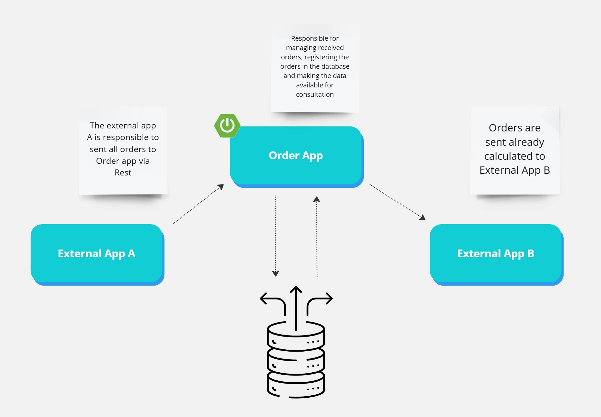
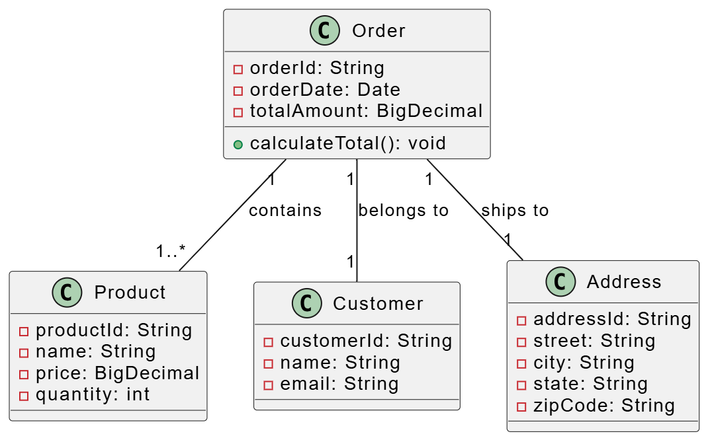

# Order Management Service

## Overview
This project is a Spring Boot application designed to manage and process orders from an external system (Product A) and send calculated order data to another external system (Product B). The application also stores order information in a MongoDB database for persistence.

---

## Features
- Integration with external systems via APIs.
- Management and calculation of product orders.
- RESTful endpoints for querying order status and data.
- Data persistence using MongoDB.

## Improvement Proposals
- It is recommended that interactions between system A and system B be carried out using a messaging mechanism such as Apache Kafka in order to avoid impacting the systems between outages.

---

## Architecture
The architecture includes:
1. **External System A**: Source of incoming orders.
2. **Order Management Service**: Processes and calculates orders.
3. **MongoDB**: Stores order data.
4. **External System B**: Receives processed order data.



---

## UML Diagram
Below is the UML class diagram that outlines the data structure for managing orders:



---

## Technologies Used
- **Spring Boot**: Application framework for developing the service.
- **MongoDB**: NoSQL database for storing order data.
- **Java 17**: Programming language.
- **Maven**: Build and dependency management tool.
- **REST APIs**: Communication between systems.

---

## Setup and Installation
### Prerequisites
- Java 17 or higher.
- Maven 3.8+.
- Docker (optional, for MongoDB container).

### Steps
1. Clone the repository:
   ```bash
   git clone <repository-url>
   ```

2. Navigate to the project directory:
   ```bash
   cd order-management-service
   ```

3. Build the project:
   ```bash
   mvn clean install
   ```

4. Run MongoDB (optional, via Docker):
   ```bash
   docker run -d --name mongodb -p 27017:27017 mongo
   ```

5. Run the application:
   ```bash
   mvn spring-boot:run
   ```

---

## Endpoints
### Order Management Endpoints
- `POST /orders`: Receives orders from External System A.
- `GET /orders/{id}`: Retrieves details of a specific order.
- `GET /orders/status`: Retrieves the status of all orders.
- `POST /orders/send`: Sends processed orders to External System B.

---

## Next Steps
1. Implement error handling and logging.
2. Test API endpoints with tools like Postman.
3. Optimize MongoDB queries for performance.
4. Conduct stress tests to ensure the system handles high order volumes efficiently.

---

## Info
- This README file was created with the help of ChatGPT, the entire development of the project was created by José Henrique Paiva with the aim of carrying out a technical challenge.
