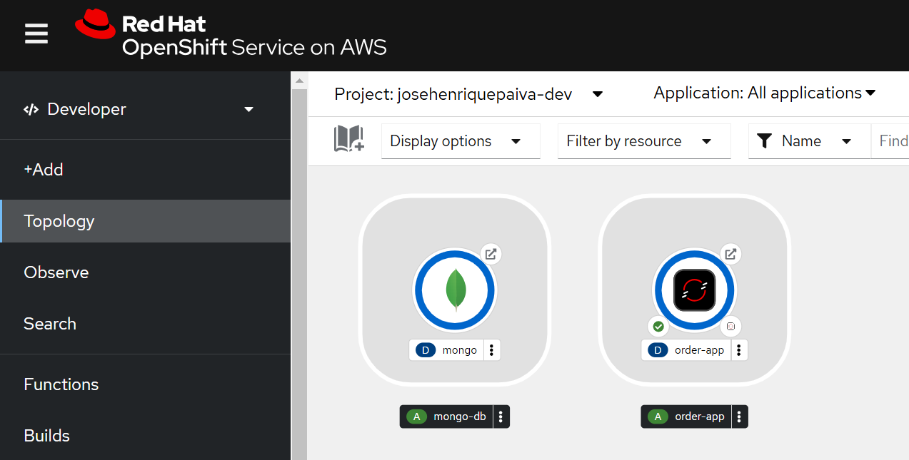
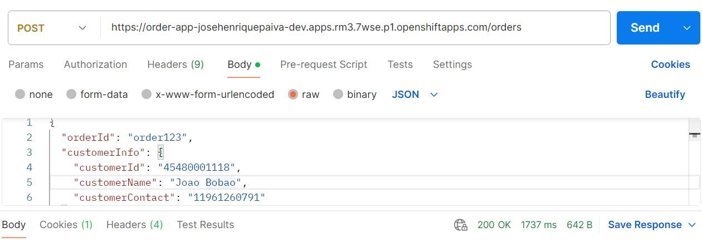

# Order Management Service

## Overview
This project is a Spring Boot application designed to manage and process orders from an external system (Product A) and send calculated order data to another external system (Product B). The application also stores order information in a MongoDB database for persistence.

---

## Features
- Integration with external systems via APIs.
- Management and calculation of product orders.
- RESTful endpoints for querying order status and data.
- Data persistence using MongoDB.

## Improvement Proposals
- It is recommended that interactions between system A and system B be carried out using a messaging mechanism such as Apache Kafka in order to avoid impacting the systems between outages.
- TODO: Implement Unit Tests

---

## Architecture
The architecture includes:
1. **External System A**: Source of incoming orders.
2. **Order Management Service**: Processes and calculates orders.
3. **MongoDB**: Stores order data.
4. **External System B**: Receives processed order data.


---

## UML Diagram
Below is the UML class diagram that outlines the data structure for managing orders:


---

## Technologies Used
- **Spring Boot**: Application framework for developing the service.
- **MongoDB**: NoSQL database for storing order data.
- **Java 17**: Programming language.
- **Maven**: Build and dependency management tool.
- **REST APIs**: Communication between systems.

---

## Swagger Integration
The application uses **Swagger** for API documentation. Once the application is running, you can access the Swagger UI at:

```
http://localhost:8080/swagger-ui.html
```

This will provide an interactive interface to view and test all available API endpoints.

---

## Setup and Installation
### Prerequisites
- Java 17 or higher.
- Maven 3.8+.
- Docker (optional, for MongoDB container).

### Steps
1. Clone the repository:
   ```bash
   git clone <repository-url>
   ```

2. Navigate to the project directory:
   ```bash
   cd order-management-service
   ```

3. Build the project:
   ```bash
   mvn clean install
   ```

4. Run MongoDB (optional, via Docker):
   ```bash
   docker run -d --name mongodb -p 27017:27017 mongo
   ```

5. Run the application:
   ```bash
   mvn spring-boot:run
   ```

---

## Endpoints
### Order Management Endpoints
- `POST /orders`: Receives orders from External System A.
- `GET /orders/filterByDate`: Retrieves orders filter by date.
- `GET /orders/filterByCustomerId`: Retrieves orders filter by CustomerId.
- `GET /orders`: List all orders


---

## Evidence of Success
To validate the successful execution of the application, use the sample payload located in the `resources/tests-payload` folder. The `payload.json` file contains a sample order that can be sent to the `/orders` endpoint.

You can also check the **evidence image** of successful execution in the `images` folder. The file `openshift-order-app.png` contains a screenshot of the API response and system state after processing an order.




---

## OpenShift Deployment
To deploy the application on **Red Hat OpenShift Sandbox**, follow these steps:

1. **Create an OpenShift account** (if you don't have one yet) and sign in to the OpenShift Sandbox:
   - Visit [OpenShift Sandbox](https://console.redhat.com/openshift/sandbox) and create an account or log in (Free).

2. **Create a new project**:
   - Once logged in to OpenShift, create a new project by navigating to the OpenShift Console and clicking on "Create Project."

3. **Deploy the application**:
   - In the OpenShift Console, go to **Developer** view and click on **Import from Git**.
   - In the Git repository URL field, enter the following repository URL:
     ```
     https://github.com/henriquesanz/order-app
     ```
   - Make sure to select **Dockerfile** as the build strategy, as the project contains a Dockerfile for the application.

4. **Configure the MongoDB container**:
   - In the same project, deploy the MongoDB container from Docker Hub by running the following command in the OpenShift terminal:
     ```bash
     oc new-app mongo --name=mongodb
     ```
   - Alternatively, you can use the **OpenShift Catalog** to select the MongoDB container image.

5. **Link the MongoDB service**:
   - Ensure that the **Order Management Service** is linked to the **MongoDB** service. This can be done by setting environment variables in the application deployment configuration that point to the MongoDB service.

6. **Expose the application**:
   - To make the application publicly accessible, expose the service with the following command:
     ```bash
     oc expose svc/order-management-service --port=8080
     ```
   - This will generate a URL where you can access the application and test its API, including Swagger UI.

7. **Access the application**:
   - Once the deployment is complete, access the Swagger UI by navigating to the provided OpenShift route (the URL exposed in the previous step).
---

## Next Steps
1. Implement error handling and logging.
2. Test API endpoints with tools like Postman.
3. Optimize MongoDB queries for performance.
4. Conduct stress tests to ensure the system handles high order volumes efficiently.

---

## Info
- This README file was created with the help of Copilot, the entire development of the project was created by José Henrique Paiva with the aim of carrying out a technical challenge.
